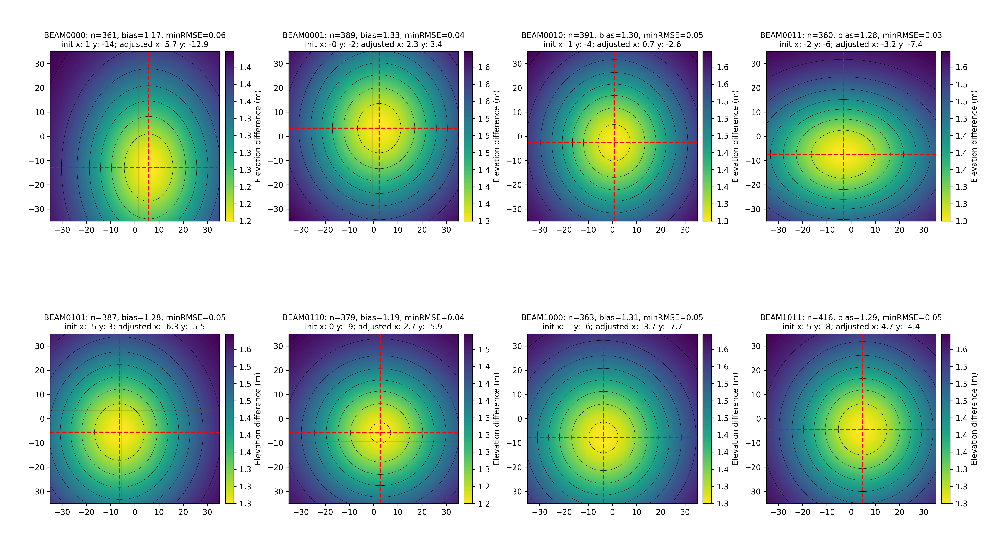
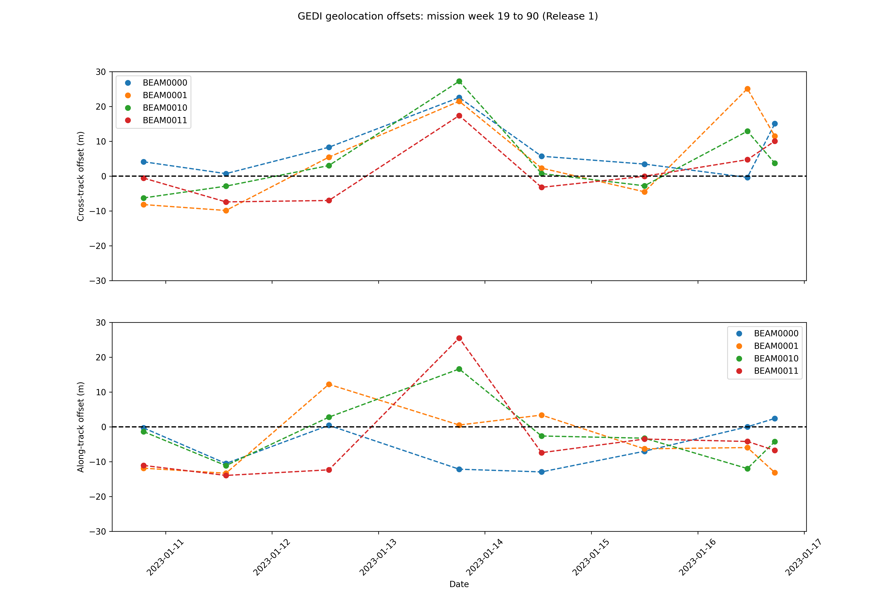
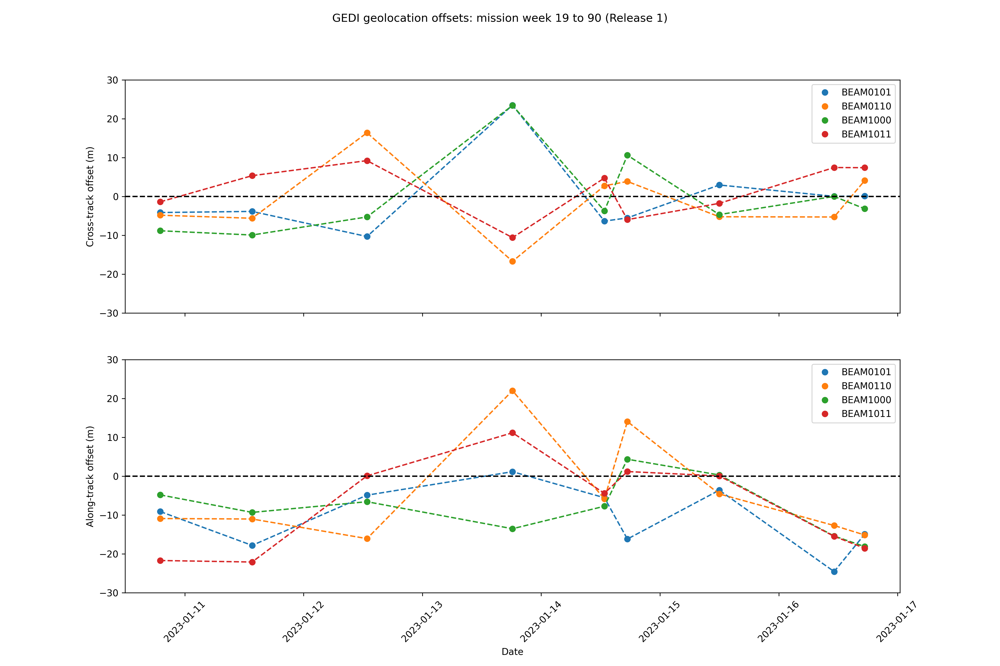

# README  
  
  
  

This project utilizes Google Earth Engine to assess and correct geolocation errors of GEDI L2A spaceborne LiDAR data using 3DEP 1-meter airborne LiDAR data.

This repository contains the code used for personal testing purposes. This is a concise version of the README; a comprehensive version will be provided in the future. For any inquiries, please contact [2001212684@alumni.pku.edu.cn](mailto:2001212684@alumni.pku.edu.cn).   
  
## Prerequisites  
  
· Python 3.x  
  
· pip  
  
· Google Earth Engine API key  
  
## Installation  
  
  
1. Clone the repository:  
  
  
`git clone https://github.com/LobstyuII/GEDI_elev_correction.git`  
  
`cd GEDI_elev_correction`  
  
2. Install required packages  
  
`pip install -r requirements.txt`  
  
## Configuration  
  
Ensure the GEE API information are correctly replaced in the specified lines of the Python scripts.  
Place your GEE API cipher files in the :/GEDI_elev_correction directory,   
Replace Line 15 and Line 16 in ":/GEDI_elev_correction/Calculating_elev_diffs.py"; and Line 38 and Line 39 in ":/GEDI_elev_correction/Load_GEDI_L2A_files.py" with your own GEE API information.  
Place the GEDI_L2A .h5 files in the :/GEDI_data directory.  
  
A version supporting I/O replacement of keys will be released in the future.  
  
## Usage  
  
To get started, run `run.py`:  
  
`python run.py`  
  
## Introduction  
  
#### core.run_part1():  
  
**"Load_GEDI_L2A_files.py"** performs the following steps:  
  
1. Reads GEDI_L2A ".h5" files.  
2. Checks the availability of footprints using the "surface_flag" attribute.  
3. Examines "Land cover" features through the Google Earth Engine API.  
4. Filters bare ground footprints.  
  
Place the GEDI_L2A “.h5” files in the `:/GEDI_data` directory. This part concludes with the generation of ".csv" files for use in the next step.  
  
#### core.run_part2():  
  
**"Calculating_elev_diffs.py"** performs the following steps:  
  
1. Creates a 45m × 45m matrix in the orbit direction for the center of each footprint.  
2. Downloads 1m-3DEP elevations through the Google Earth Engine API.  
3. After applying Gaussian filtering, calculates the differences with GEDI elevations corrected to the LAVD88 coordinate system within a 35m × 35m matrix.  
  
This part concludes with the generation of ".npy" files for use in the next step.  
  
#### core.run_part3():  
  
**"Calculating_2D_gaussian.py"** performs the following steps:  
  
1. Conducts 2D Gaussian fitting on the generated average elevation difference matrix, saving the resulting matrix as ".npy" files.  
2. Calculates various parameters for each beam, saving them as ".csv" files.  
  
#### core.run_part4():  
  
**"plot_bullseye.py"** generates bullseye plots for the 8 beams for each observation into the ":/figures" directory.  
**"plot_timeseries.py"** generates time-series line plots for all observations across different orbits.